# Hi, I'm Dias 👋

Fullstack developer working across web,right now working on a corparate platform for Ward English.

## About Me

## Tools

## Technology Stack

## Stats

  
  

  

  

<!--START_SECTION:waka-->
<!-- This section fills in automatically if you run a WakaTime README-stats action. -->
<!--END_SECTION:waka-->

<!--
**DiasTime/DiasTime** is a ✨ _special_ ✨ repository because its `README.md` (this file) appears on your GitHub profile.

Here are some ideas to get you started:
- 🔭 I'm currently working on ...
- 🌱 I'm currently learning ...
- 👯 I'm looking to collaborate on ...
- 🤔 I'm looking for help with ...
- 💬 Ask me about ...
- 📫 How to reach me: ...
- 😄 Pronouns: ...
- ⚡ Fun fact: ...
-->